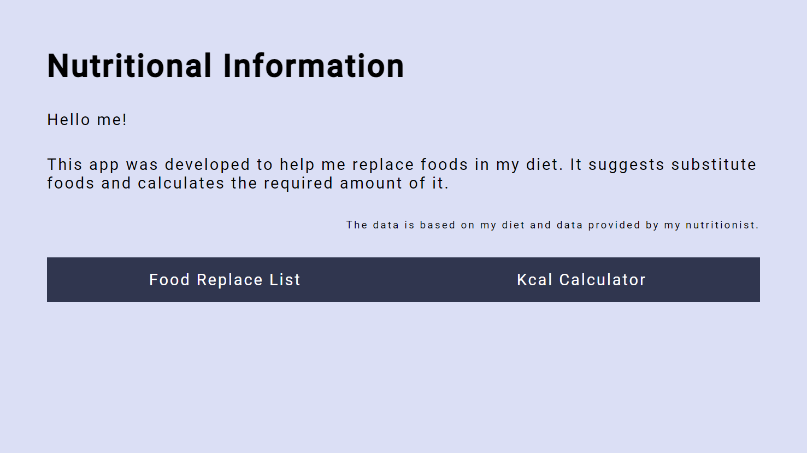

# Nutritional Information Project
### Introduction

This is a React web application. This app was developed to help me replace foods in my diet. It lists substitute foods and calculates the required amount of it. You can also add a new food to the list. All you have to do is add the nutritional values of the new food. It's responsive, so I can use it on any device, whether on a cell phone or on a computer.

Contents
========

 * [Why?](#why)
 * [How To Use?](#how-to-use)
 * [Technologies](#technologies)
 * [Project status](#project-status)

 
 ## Why?
 
 I wanted to practice my knowledge of React components, hooks and React Router. I also wanted to create features that make easy to calculate the amount of food that replaces my meal plan.

 <a href="https://nutritional-info-94609.web.app/">
  
</a>

 Or you can also view the live page **[here](https://nutritional-info-94609.web.app/)**.
 
 ## How To Use?
 
You'll need [Node.js](https://nodejs.org/en/download/) (which comes with [npm](http://npmjs.com)) installed on your computer to run locally
 
 ```bash
# Clone this repository
$ git clone https://github.com/AlessandraMorita/Nutritional_Table

# Go into the repository
$ cd Nutritional_Table

# Installs the required dependencies
$ npm install

# Run the React project
$ npm start
```

## Technologies

* HTML
* CSS
* JavaScript
* React

## Project status

The project is still being developed. Next challenges:

* Add more features
